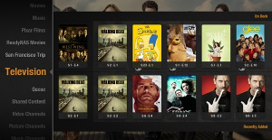

  

  

    <h1>RasPlex Setup Basics</h1>
    

      

        

          

            <h2>Step 1: Setup Plex</h2>
            
            
<a href="http://plexapp.com/getplex/">Plex Media Server</a> is required to be installed on your home computer in order to use RasPlex.

            
It will organize your media on your computer for you, automatically get stuff like Movie posters, actors, episode descrptions - you name it! While you're at it, set up some plex channels and a myPlex account. 

            
It is closed source, but free to use. Please consider <a href="https://my.plexapp.com/subscription/about" target="_blank"> purchasing a PlexPass </a> to support <a href="http://www.plexapp.com/" target="_blank"> Plex Inc</a>.

          

          

            <h2>Step 2: Setup RasPlex</h2>
            
            
Follow the steps to <a href="../get-started/rasplex-installers.html">get RasPlex</a>, and set up a RasPlex box on every TV in your home. At the meager cost of a Raspberry Pi, why not get some for your friends and family to share all of your media!

            
<strong>Please note:</strong> the first run of RasPlex will always be the slowest, and RasPlex performs better on 512MB Raspberry Pi's than on 256MB. To speed things up, you should manually force caching as described in <a href="faq.html">the FAQ</a>

          

          

            <h2>Step 3: Enjoy</h2>
            
            
You'll have now turned every TV in your home into a Smart TV. Enjoy streaming your Music, Movies, and TV shows, as well as Apple Airplay. Soon you can look forward to Plex Channels and Retro console games too!

          

        

      

    

  

